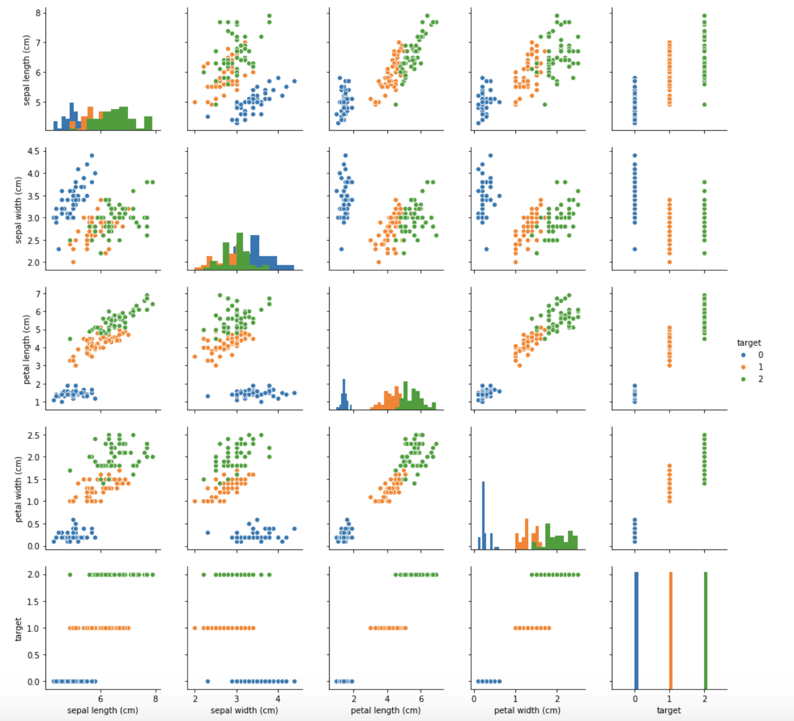
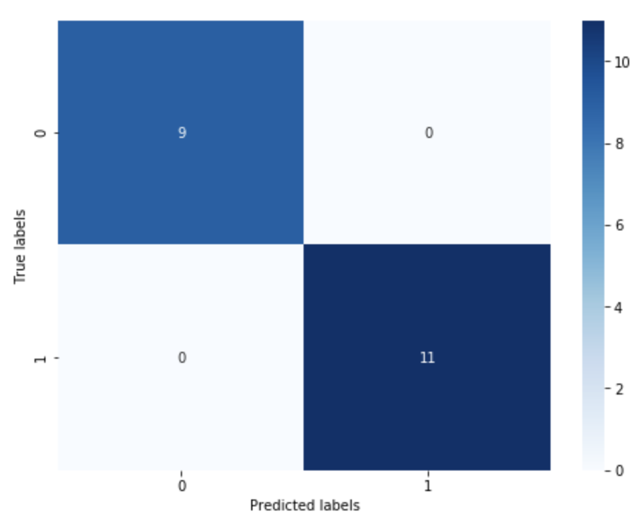

# 基于逻辑回归的分类预测

### 1. 逻辑回归的介绍

逻辑回归实际上是一个分类模型，其优点为 ***模型简单*** 和 ***可解释性强***。 其缺点是由于模型复杂度不高，容易造成模型欠拟合的现象。
逻辑回归模型现在同样是很多分类算法的基础组件,比如分类任务中基于GBDT算法+LR逻辑回归实现的信用卡交易反欺诈，CTR(点击通过率)预估等，其好处在于输出值自然地落在0到1之间，并且有概率意义。模型清晰，有对应的概率学理论基础。它拟合出来的参数就代表了每一个对结果的影响。也是一个理解数据的好工具。但同时由于其本质上是一个线性的分类器，所以不能应对较为复杂的数据情况。

逻辑回归本质上等于线性回归加sigmoid激活函数，将回归方程  置于激活函数  =\\frac{1}{1+e^{-z}}) 中

### 2.逻辑回归算法实现

借助sklearn机器学习库可轻松实现逻辑回归函数的构建：

***from sklearn.linear_model import LogisticRegression***                           （导入逻辑回归模型函数）

***lr_clf = LogisticRegression()***                                                                      （调用逻辑回归函数）
        
***lr_clf = lr_clf.fit(x_fearures, y_label)***                                                           （用逻辑回归模型拟合构造的数据集）

以上可直接用已有数据训练出一个逻辑回归模型。接着用 predict() 方法可对新数据进行预测：

***y_predict = lr_clf.predict(x_fearures_new)***                                                   (用拟合的模型来预测新数据)

***y_predic_proba = tlr_clf.predict_proba(x_fearures_new)***                          （输出预测分类的概率）
### 3. 基于鸢尾花（iris）数据集的逻辑回归分类实践

本次我们选择鸢花数据（iris）进行方法的尝试训练，该数据集一共包含5个变量，其中4个特征变量，1个目标分类变量。共有150个样本，目标变量为花的类别分别是山鸢尾 (Iris-setosa)，变色鸢尾(Iris-versicolor)和维吉尼亚鸢尾(Iris-virginica)。包含的三种鸢尾花的四个特征，分别是花萼长度(cm)、花萼宽度(cm)、花瓣长度(cm)、花瓣宽度(cm)，这些形态特征在过去被用来识别物种。

对于目标变量，为了方便表示，通常用 0，1，2 .... 来代替不同的类别。所以在本数据集中，0，1，2分别代表'setosa', 'versicolor', 'virginica'三种不同花的类别。

在dataframe中，可以使用apply( )方法结合匿名函数的用法来修改某列的值：

***iris_all['target'].apply(lambda x : 'Iris-setosa' if x == 0 else ('Iris-versicolor' if x == 1 else 'Iris-virginica'))***

为了更直观的显示特征之间的关系，seaborn库的 pairplot方法提供了可视化探索数据特征之间的关系的方法：

***sns.pairplot(data=iris_all,kind="scatter",diag_kind='hist', hue= 'target')***  
***plt.show()***

（diag_kind用于控制对角线上图的类型，kind用于控制非对角线上图的类型，hue针对某一字段进行分类）

其中，对角线上是各个属性的直方图（分布图），而非对角线上是两个不同属性之间的相关图。从图中可发现，花瓣的长度和宽度之间以及萼片的长短和花瓣的长、宽之间具有比较明显的相关关系。
#### 3.1  二分类的逻辑回归模型

由于是二分类模型，所以在数据上只能选取target为 0 和 1 的数据，使用 dataframe中的 loc 和 iloc 方法可以做到：

***iris_features_part = iris_features.iloc[:100]*** 

loc是根据dataframe的index来索引对应的行。iloc并不是根据index来索引，而是根据行号来索引，行号从0开始，逐次加1。

逻辑回归参数选择：
clf = LogisticRegression(random_state=0, solver='lbfgs')， solver参数决定了损失函数优化算法的选择。

有4种算法可以选择，分别是：

* liblinear：使用了开源的liblinear库实现，内部使用了坐标轴下降法来迭代优化损失函数。
　　　　
* lbfgs：拟牛顿法的一种，利用损失函数二阶导数矩阵即海森矩阵来迭代优化损失函数。
　　　　
* newton-cg：也是牛顿法家族的一种，利用损失函数二阶导数矩阵即海森矩阵来迭代优化损失函数。
　　
*  sag:
随机平均梯度下降，是梯度下降法的变种，和普通梯度下降法的区别是每次迭代仅仅用一部分的样本来计算梯度，适合于样本数据多的时候，SAG是一种线性收敛算法，这个速度远比SGD快。

训练好模型之后，可以用来在测试集上进行预测并评估模型。
对于分类问题来说，一般有四类模型评估指标：accuracy，precision，recall, F-measure

accuracy =  所有分类正确的样本 / 所有样本 ， 但当数据样本分布不均匀（目标分类变量中正负类数量不均匀）时这一评估指标并不能很好地评估分类器。

***confusion_matrix_result = metrics.confusion_matrix(test_predict,y_test)***                   混淆矩阵是一种能反映出预测值和真实值各类情况统计矩阵。

从混淆矩阵热力图可看出：

* 真阳性样本：true_positive = 11                  （实际为正样本，预测也为正）
* 真阴性样本：true_negative = 9                   （实际为负样本，预测也为负）
* 假阳性样本：false_postive = 0                    （实际为负样本，预测为正）
* 假阴性样本：false_negative = 0                  （实际为正样本，预测为负）

precision = true_positive / (true_positive + false_postive)                      预测的正例有多少是正确的，分母为所有的预测正样本

recall = true_positive / (true_positive + false_negative)                          有多少正例样本被召回，分母为所有的实际正样本

F1 = 2 * precision * recall / (precision + recall)                           F-Measure是Precision和Recall加权调和平均

#### 3.2  多分类的逻辑回归模型

普通的logistic回归只能针对二分类问题，要想实现多个类别的分类，我们必须要改进logistic回归，让其适应多分类问题。

    
